# PulseScope Analytics


PulseScope Analytics is an end-to-end product analytics system for a consumer application that combines a personalized news feed with direct messaging.

The project covers the full analytics lifecycle, including analytical data modeling, ETL automation, KPI dashboards, retention and cohort analysis, A/B testing, forecasting, automated stakeholder reports, and near-real-time anomaly detection.

---

## Project Overview

PulseScope Analytics models the analytics environment of an early-stage consumer technology company.

The application has two primary product surfaces:

- A personalized news feed where users view and like posts
- A messaging feature where users communicate directly

Both features generate large volumes of behavioral event data. The objective was to turn those raw events into a reliable analytical system that could help product, marketing, engineering, and leadership teams answer questions such as:

- How many users engage with each product feature?
- Are newly acquired users returning after registration?
- Which user segments are growing or declining?
- Did a product experiment improve engagement?
- Why did a key metric suddenly fall?
- How much user activity should the infrastructure support next week?
- Can recurring performance updates be delivered automatically?
- Can abnormal metric movements be detected before they become larger incidents?

The completed system connects data infrastructure, statistical analysis, business intelligence, forecasting, automation, and monitoring in one workflow.

---

## Business Problem

A growing product team needs more than isolated SQL queries or manually prepared reports.

Without a centralized analytics workflow, teams can face several problems:

- Product metrics are calculated differently across analyses.
- Analysts repeatedly query raw event tables for the same KPIs.
- Stakeholders depend on the data team for routine updates.
- Experiment decisions may be made without validating statistical reliability.
- Sudden metric changes may remain unnoticed for hours or days.
- Infrastructure teams have limited visibility into expected usage growth.
- Manual reporting takes time and may not follow a consistent format.
- Historical user behavior is difficult to compare across acquisition channels and product features.

PulseScope Analytics addresses these issues by creating a reusable analytical layer and connecting it to dashboards, statistical workflows, scheduled reports, forecasts, and alerts.

---

## Solution Architecture

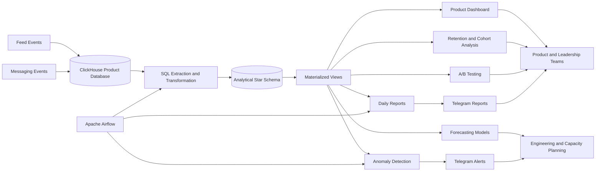
```mermaid
flowchart LR
    A[Feed Events] --> C[(ClickHouse Product Database)]
    B[Messaging Events] --> C

    C --> D[SQL Extraction and Transformation]
    D --> E[(Analytical Star Schema)]
    E --> F[Materialized Views]

    F --> G[Product Dashboard]
    F --> H[Retention and Cohort Analysis]
    F --> I[A/B Testing]
    F --> J[Forecasting Models]
    F --> K[Daily Reports]
    F --> L[Anomaly Detection]

    M[Apache Airflow] --> D
    M --> K
    M --> L

    K --> N[Telegram Reports]
    L --> O[Telegram Alerts]

    G --> P[Product and Leadership Teams]
    H --> P
    I --> P
    J --> Q[Engineering and Capacity Planning]
    N --> P
    O --> Q
```

### Workflow Summary

1. Product events are stored in ClickHouse.
2. SQL queries transform raw user activity into reusable analytical metrics.
3. A star schema organizes the data for downstream analysis.
4. Materialized views improve recurring dashboard-query performance.
5. Apache Airflow loads incremental data on a schedule.
6. Dashboards provide self-service access to product KPIs.
7. Python notebooks support deeper retention, experimentation, and forecasting analysis.
8. Scheduled pipelines send daily reports to Telegram.
9. A statistical anomaly detector checks critical metrics every 15 minutes.
10. Alerts notify the team when unusual behavior is detected.

---

## Technology Stack

### Data and Storage

- Python
- SQL
- Pandas
- ClickHouse
- Star schema modeling
- Materialized views
- Incremental data loading

### Business Intelligence

- Apache Superset
- Yandex DataLens
- Plotly
- KPI dashboard design
- Product metric documentation
- Self-service analytics

### Statistics and Experimentation

- SciPy
- Statsmodels
- Pingouin
- A/A testing
- A/B testing
- Hypothesis testing
- Confidence intervals
- Sample-size estimation
- Statistical power analysis
- Monte Carlo simulation

### Forecasting

- Uber Orbit
- ETS
- Local Global Trend model
- Damped Local Trend model
- Kernel-based Time-varying Regression
- Rolling-window validation
- Expanding-window validation
- SMAPE
- MAE

### Automation and Monitoring

- Apache Airflow
- DAG orchestration
- Telegram Bot API
- Scheduled reporting
- Median Absolute Deviation anomaly detection
- Configurable alert thresholds
- Near-real-time metric monitoring

---

## Data Sources

The product database contains two primary event tables.

### `feed_actions`

Records activity in the personalized feed, including:

- Post views
- Likes
- User identifiers
- Event timestamps
- Device information
- Operating system
- User demographics
- Geographic information
- Traffic source

### `message_actions`

Records messaging activity, including:

- Sender identifiers
- Receiver identifiers
- Message timestamps
- User attributes
- Device information
- Geographic information
- Traffic source

These tables support both feature-level analysis and application-wide user metrics.

---

## Core Metrics

The project calculates and monitors metrics across acquisition, engagement, retention, experimentation, and infrastructure usage.

### Product Engagement

- Daily Active Users
- Weekly Active Users
- Monthly Active Users
- Feed views
- Feed likes
- Click-through rate
- Messages sent
- Active senders
- Active receivers
- Actions per user
- Feature adoption

### Growth and Retention

- New users
- Retained users
- Churned users
- Day-1 retention
- Cohort retention
- Organic versus paid acquisition
- User lifecycle decomposition
- Acquisition-channel performance

### Experimentation

- User-level CTR
- Control and treatment comparisons
- Statistical significance
- Distribution diagnostics
- Sample-size requirements
- Statistical power
- Experiment quality checks
- Rollout recommendations

### Operations and Reliability

- Total product actions
- Metric deviations
- Forecasted activity
- Forecast error
- Anomaly thresholds
- Feed and messenger service health

---

## Analytics Workflow

## 1. Analytical Data Warehouse

[View the analytical database notebook](./building_startup_analytics/1_data_infrastructure/1_analytical_database.ipynb)

### Problem

The original product tables are optimized for recording user activity, not for repeatedly calculating business metrics.

Dashboard queries directly against raw event data would require repeated joins, aggregations, and transformations. This would make metric definitions harder to maintain and could increase dashboard response time.

### Implementation

I built an analytical layer that:

- Extracts activity from feed and messaging tables
- Defines reusable dimensions and measures
- Organizes product data using a star schema
- Loads historical data into analytical tables
- Creates materialized views for frequently requested metrics
- Supports daily incremental processing
- Uses an Airflow DAG to load the previous day’s data
- Creates a consistent foundation for dashboards and analysis

### Data Modeling

The analytical schema separates measurable activity from descriptive attributes.

Examples include:

- User activity facts
- Calendar dimensions
- User dimensions
- Geography dimensions
- Device dimensions
- Traffic-source dimensions
- Feed metrics
- Messaging metrics

### Why It Matters

This layer creates a single reusable source for downstream reporting and prevents every analysis from independently recreating the same metric logic.

### Analytical Schema

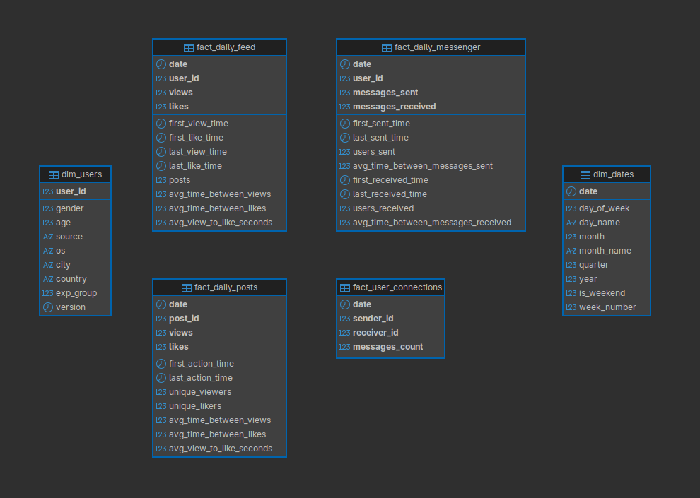

---

## 2. Product Performance Dashboard

[View the dashboard notebook](./building_startup_analytics/2_product_dashboard/2_product_dashboard.ipynb)

### Problem

Product and management teams need to monitor application performance without requesting a new analysis for every question.

### Implementation

I developed a multi-page product dashboard that covers:

- Application-wide performance
- Feed engagement
- Messaging engagement
- User growth
- Retention
- Feature-level activity
- Demographic and geographic segments
- Acquisition sources
- Metric definitions and dashboard documentation

Before implementing the dashboard, I defined:

- Target users
- Business questions
- KPI definitions
- Required filters
- Visualization types
- Page layout
- Drill-down behavior
- Documentation requirements

### Dashboard Sections

#### Application Overview

Provides a consolidated view of product adoption, total activity, user growth, and engagement across both features.

<details>
<summary>View application overview screenshots</summary>

<br>

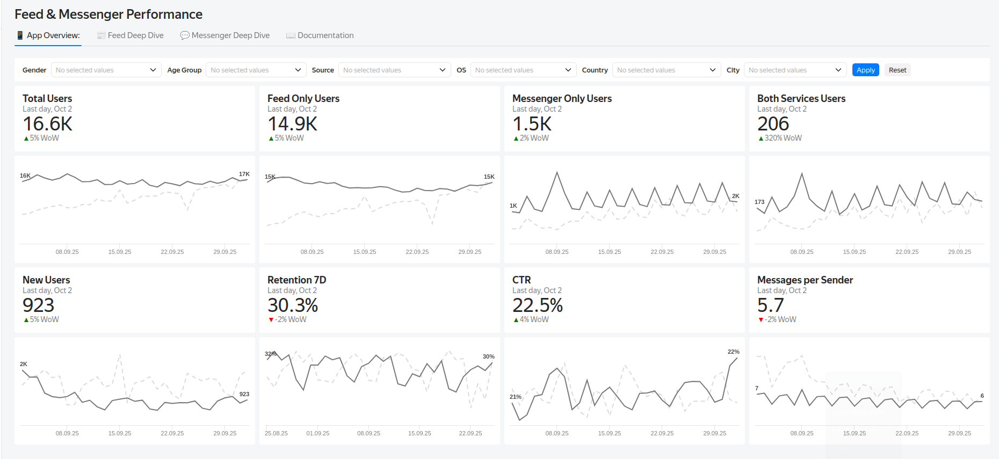

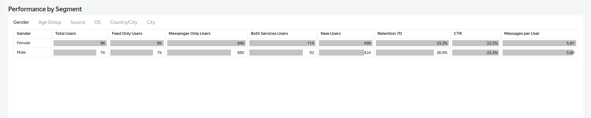

</details>

#### Feed Deep Dive

Focuses on feed usage, content interactions, views, likes, CTR, and user engagement.

<details>
<summary>View feed dashboard screenshots</summary>

<br>

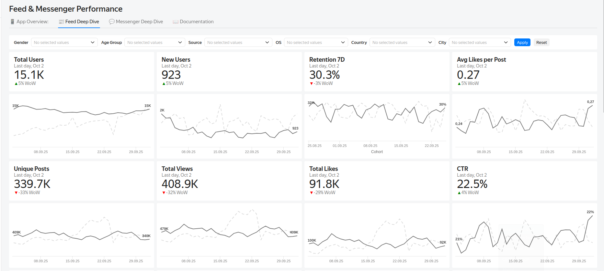

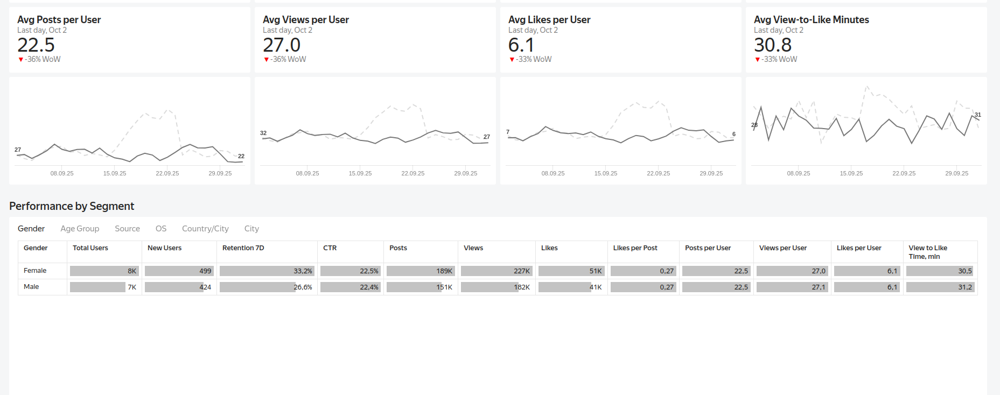

</details>

#### Messenger Deep Dive

Tracks messages, active communicators, messaging frequency, and engagement patterns.

<details>
<summary>View messenger dashboard screenshots</summary>

<br>

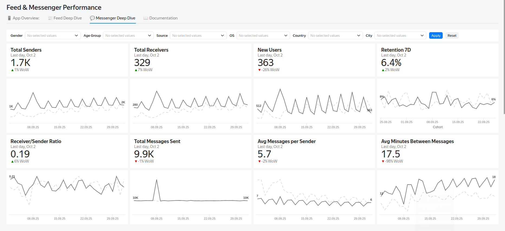

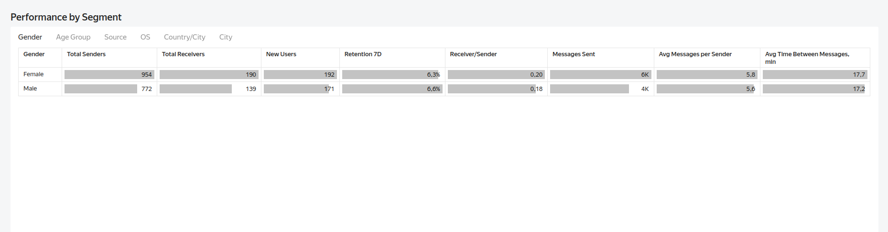

</details>

#### Dashboard Documentation

Documents the meaning of metrics, filters, calculations, and expected dashboard behavior.

<details>
<summary>View dashboard documentation screenshots</summary>

<br>

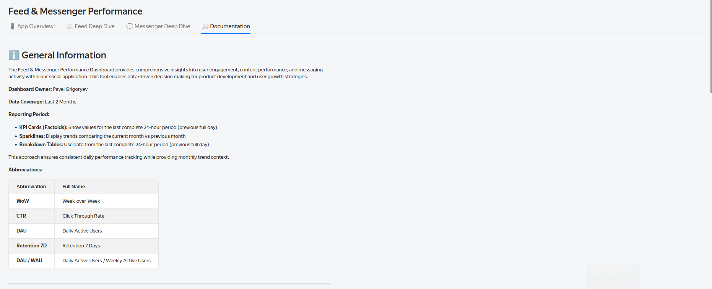

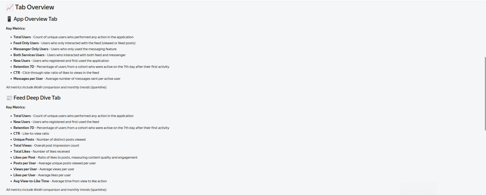


</details>

### Decision Value

The dashboard demonstrates how a centralized analytical layer can give non-technical stakeholders direct access to consistent product metrics while reducing repetitive reporting requests.

---

## 3. Retention and Metric Investigation

[View the metric deep-dive notebook](./building_startup_analytics/3_metric_deep_dive/3_metric_deep_dive.ipynb)

This module investigates two separate product events:

1. A marketing campaign that generated a large increase in new users
2. A sudden decline in feed activity that required root-cause analysis

It also creates a recurring user-lifecycle view for tracking growth and churn.

### Marketing Campaign Analysis

The analysis compares users acquired through an advertising campaign with users acquired organically.

The workflow includes:

- Identifying the campaign cohort
- Measuring initial product engagement
- Calculating Day-1 retention
- Comparing campaign users with historical organic cohorts
- Investigating whether acquisition volume translated into retained usage
- Segmenting performance by user attributes

### Findings

- The campaign generated a substantial increase in new users.
- Initial usage behavior was broadly comparable with organic users.
- Day-1 retention was materially lower than comparable historical Friday cohorts.
- Acquisition volume alone did not indicate durable user value.

### Recommendation

Use the characteristics of historically active and retained users to refine future campaign targeting rather than optimizing only for acquisition volume.

<details>
<summary>View campaign-analysis screenshots</summary>

<br>

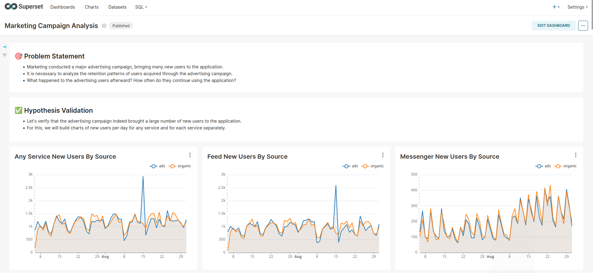

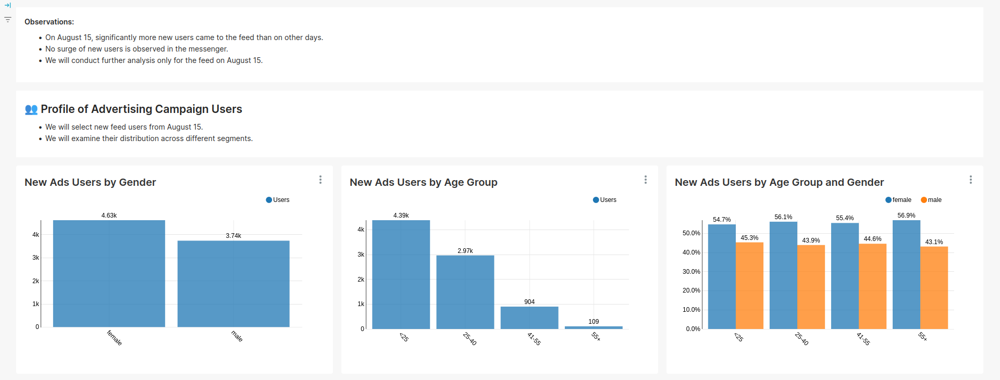

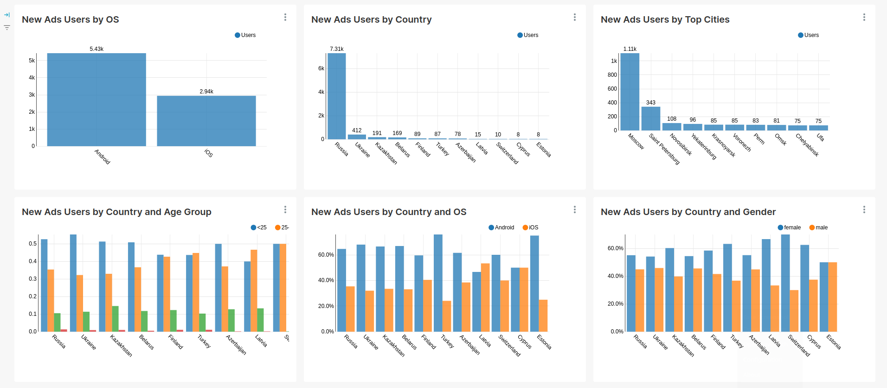

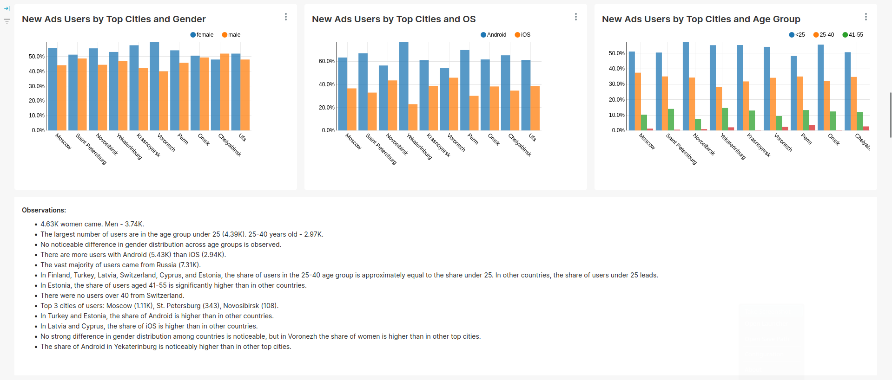

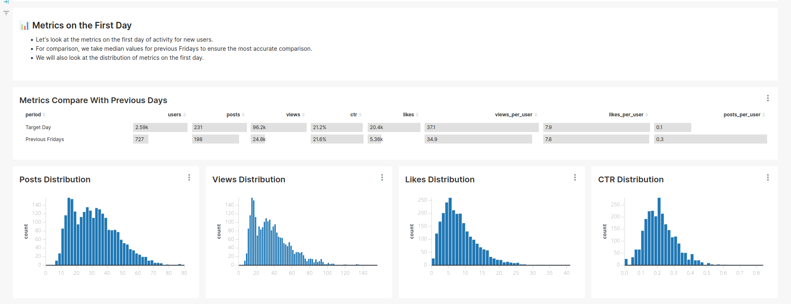

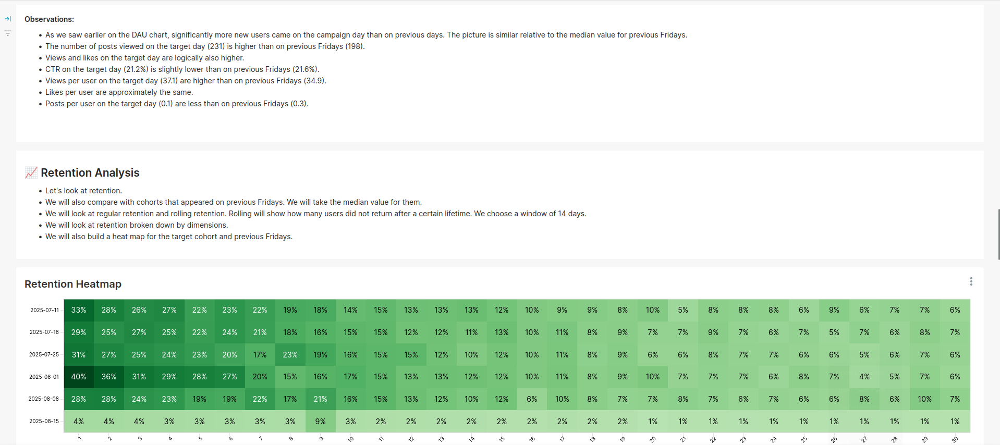

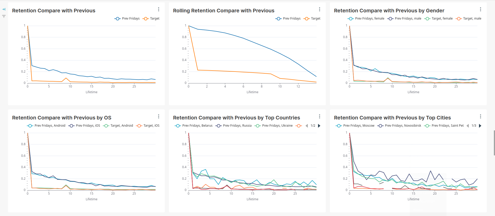

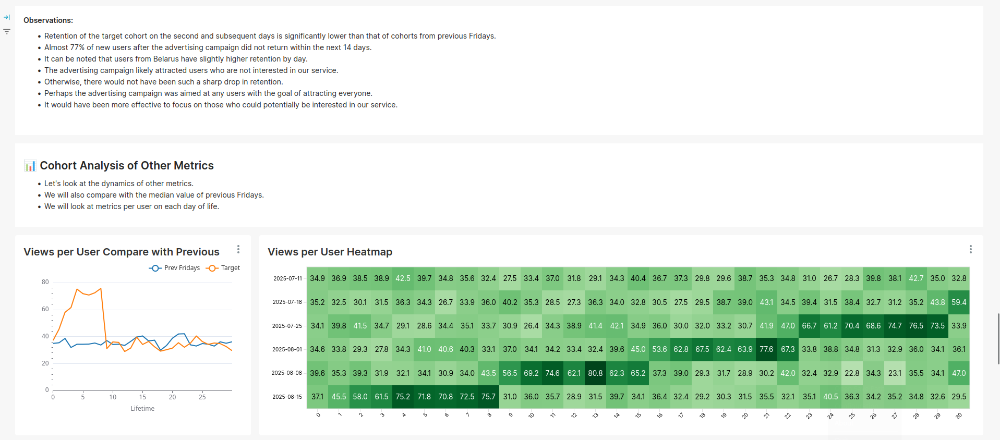

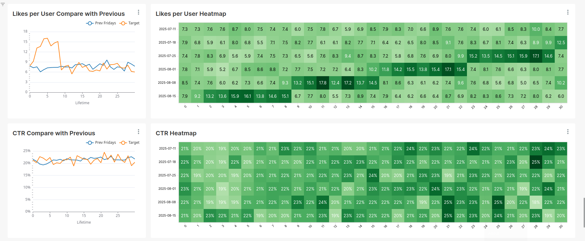

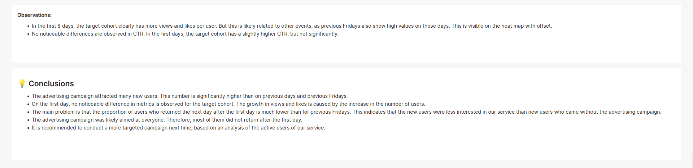

</details>

### Audience-Drop Investigation

A sharp decline in feed activity occurred on August 24.

The investigation:

- Compared feed and messenger activity
- Identified the affected users
- Segmented them by geography
- Examined device and operating-system attributes
- Checked whether both product features were affected
- Isolated the issue to feed activity

### Findings

The decline was concentrated in:

- Moscow
- St. Petersburg
- Yekaterinburg
- Novosibirsk

Messaging activity remained comparatively stable in the affected areas, suggesting that the problem was more likely associated with the feed experience or supporting infrastructure than with a full application outage.

### Recommendation

Investigate feed-serving infrastructure and regional dependencies in the affected locations. Add geographic monitoring and redundancy checks to reduce the time required to identify similar incidents.

<details>
<summary>View audience-drop investigation screenshots</summary>

<br>

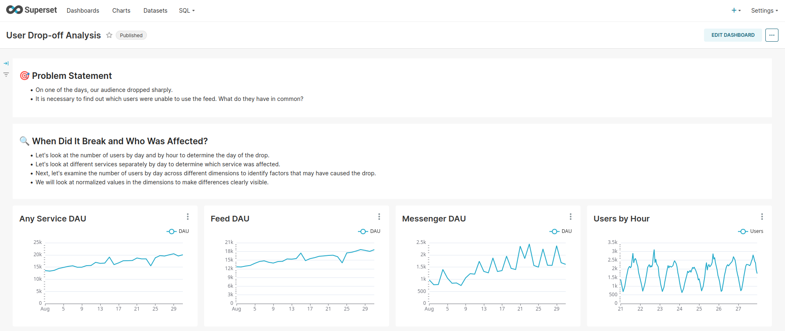

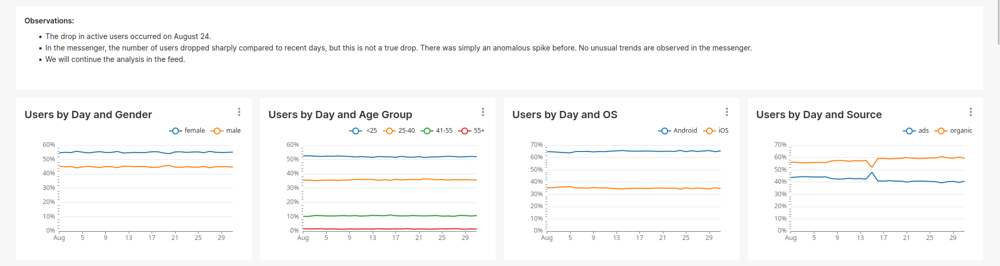

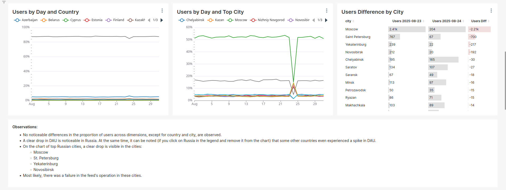

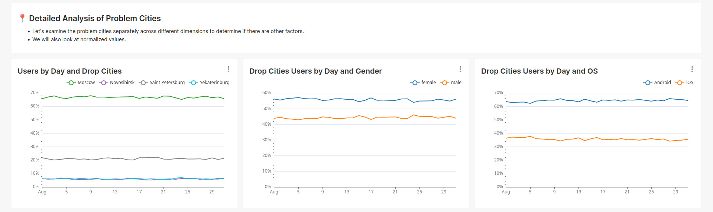

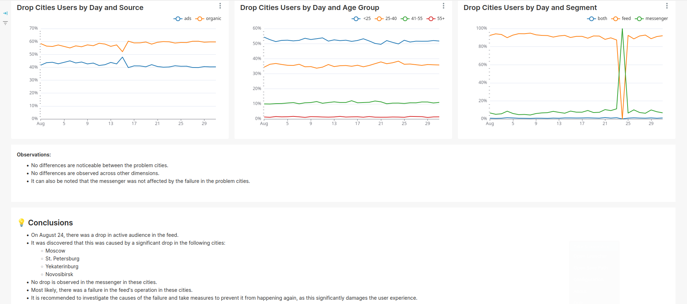

</details>

### User Lifecycle Decomposition

I also created a weekly decomposition of:

- New users
- Retained users
- Churned users

This makes it possible to distinguish acquisition-driven growth from sustainable retained growth.

<details>
<summary>View lifecycle-decomposition screenshots</summary>

<br>

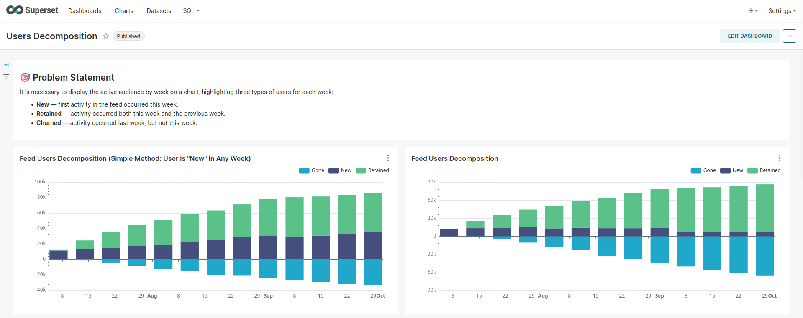

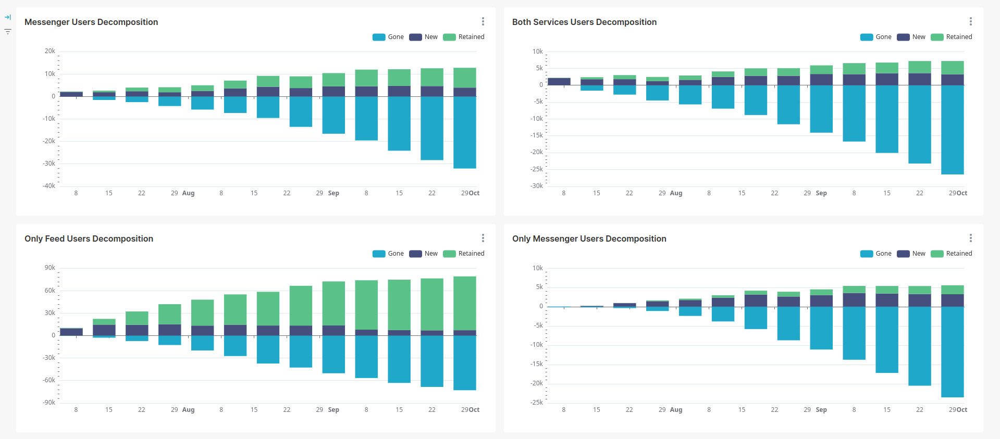

</details>

---

## 4. A/B Testing Framework

[View the A/B testing notebook](./building_startup_analytics/4_ab_testing/4_ab_testing.ipynb)

### Experiment Context

The recommendation team developed two feed-ranking approaches intended to make posts more relevant.

#### Algorithm 1: Similar to Previously Liked Posts

Shows users content that is similar to posts they previously liked.

#### Algorithm 2: Preferred by Similar Users

Shows users content liked by users with similar behavioral preferences.

The main success metric was feed click-through rate.

### Experiment Workflow

The analysis includes:

- A/A test validation
- Experimental-group assignment checks
- Sample-size estimation
- Statistical power analysis
- Monte Carlo simulation
- User-level CTR calculation
- Distribution analysis
- T-tests
- Mann-Whitney tests
- Poisson bootstrap
- Bucket-based analysis
- Daily consistency checks
- Practical rollout recommendations

### Experiment 1 Result

**Recommendation: do not roll out the algorithm.**

The treatment group displayed a bimodal CTR distribution, with modes around 10% and 30%, while historical CTR was closer to 20%.

The bimodality appeared during the first six experiment days but disappeared on the final day. That inconsistent pattern suggested a technical or assignment problem rather than a stable treatment effect.

### Experiment 2 Result

**Recommendation: proceed with a controlled rollout.**

The second recommendation approach produced:

- A statistically significant CTR increase of approximately `0.0164`
- No comparable distribution anomaly
- More consistent behavior across experiment days
- Cleaner evidence supporting an engagement improvement

### Rollout Recommendation

Expand the second algorithm gradually while monitoring:

- CTR
- User retention
- Feed activity
- Content diversity
- Latency
- Error rates
- Other guardrail metrics

The first algorithm should be investigated and retested only after identifying the source of the distribution anomaly.

### Decision Value

This section demonstrates that statistical significance alone is insufficient. Distribution quality, experiment consistency, technical validity, and operational guardrails must also be checked before launching a feature.

---

## 5. Product Metric Forecasting

[View the forecasting notebook](./building_startup_analytics/5_metric_forecasting/5_metric_forecasting.ipynb)

### Problem

Growing application usage was increasing infrastructure demand and contributing to user reports of lag.

The objective was to forecast near-term activity so engineering teams could plan capacity using expected usage rather than responding only after performance problems occurred.

### Forecasting Metrics

Two metrics were selected:

- **Total DAU** as a relatively stable measure of active audience
- **Total actions** across the feed and messenger as a proxy for infrastructure load

### Modeling Workflow

The forecasting analysis includes:

- Exploratory time-series analysis
- Trend and seasonality inspection
- Missing-value checks
- ETS models
- Local Global Trend models
- Damped Local Trend models
- Kernel-based Time-varying Regression
- MAP and MCMC estimators
- Parameter tuning
- Rolling-window backtesting
- Expanding-window backtesting
- SMAPE evaluation
- MAE evaluation
- Forecast-horizon comparison

### DAU Forecast

The strongest DAU model was:

- Damped Local Trend
- MAP estimation
- Linear trend
- No external regressors
- No additional regularization

The model achieved approximately:

- **3.9% SMAPE**

This made DAU useful for stable short-term capacity planning.

### Total Actions Forecast

The strongest total-actions model also used:

- Damped Local Trend
- MAP estimation
- Linear trend
- No external regressors

The model achieved approximately:

- **21.4% SMAPE**

Total actions were more volatile than DAU, but they remained important for estimating workload and peak activity.

### Forecasting Recommendation

- Use a seven-day forecasting horizon.
- Refresh forecasts weekly.
- Use DAU for stable baseline planning.
- Use total actions to estimate heavier workload periods.
- Maintain separate feed and messaging forecasts.
- Re-evaluate the models monthly as additional data becomes available.
- Consider longer forecast horizons only after accumulating more historical observations.

### Decision Value

This module connects analytics with infrastructure planning by converting product usage trends into forward-looking operational estimates.

---

## 6. Automated Daily Reporting

[View the automated-reporting notebook](./building_startup_analytics/6_automated_reporting/6_automated_reporting.ipynb)

### Problem

Manual reports require repeated data extraction, chart preparation, interpretation, and distribution.

The objective was to build a scheduled pipeline that automatically prepares product-performance summaries and sends them to the stakeholder communication channel.

### Implementation

The reporting workflow:

1. Queries ClickHouse for the latest product metrics.
2. Calculates application-wide and feature-specific KPIs.
3. Creates summary tables and visualizations.
4. Compares current performance with previous periods.
5. Packages the analysis into a consistent report.
6. Sends the output through the Telegram Bot API.
7. Runs automatically through an Airflow DAG.
8. Includes error handling for scheduled execution.

### Report Coverage

The daily reports include:

- Application DAU
- Feed DAU
- Messenger DAU
- Views
- Likes
- CTR
- Messages
- Metric trends
- Recent changes
- Feature-level comparisons

### Decision Value

This workflow demonstrates how recurring stakeholder reporting can be standardized and delivered without repeating the same manual preparation each day.

<details>
<summary>View automated report screenshots</summary>

<br>

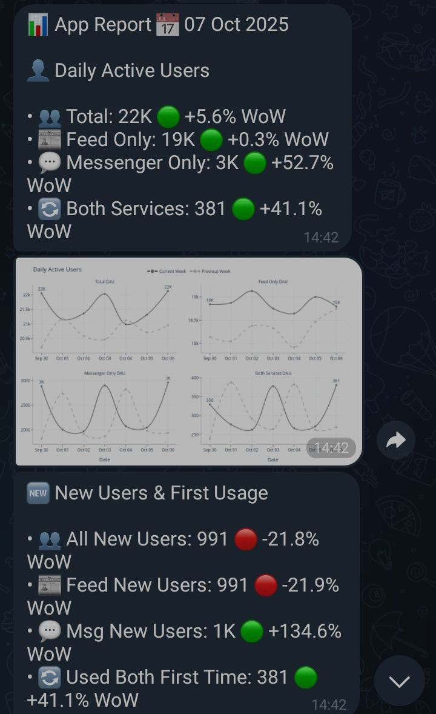

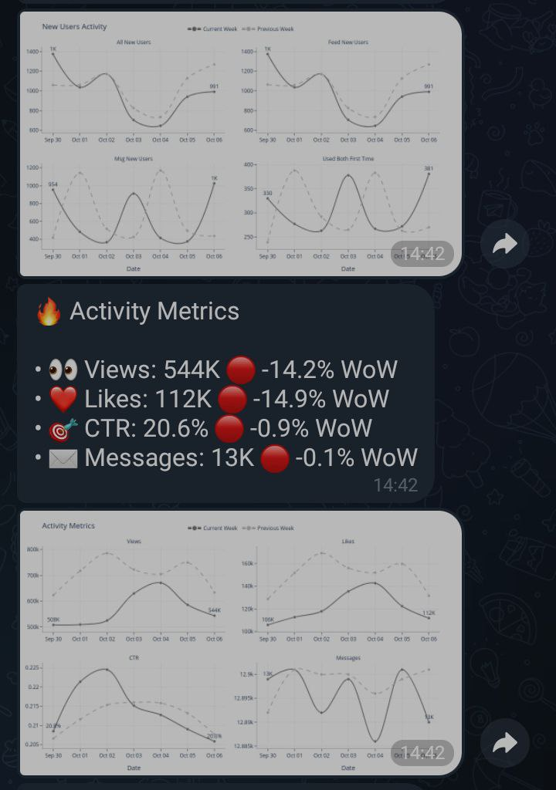

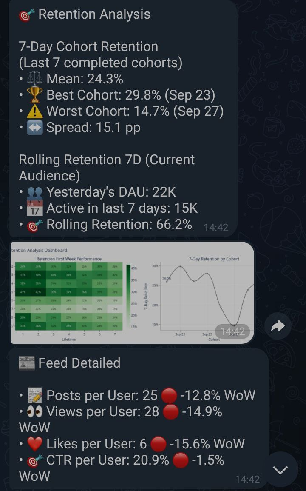

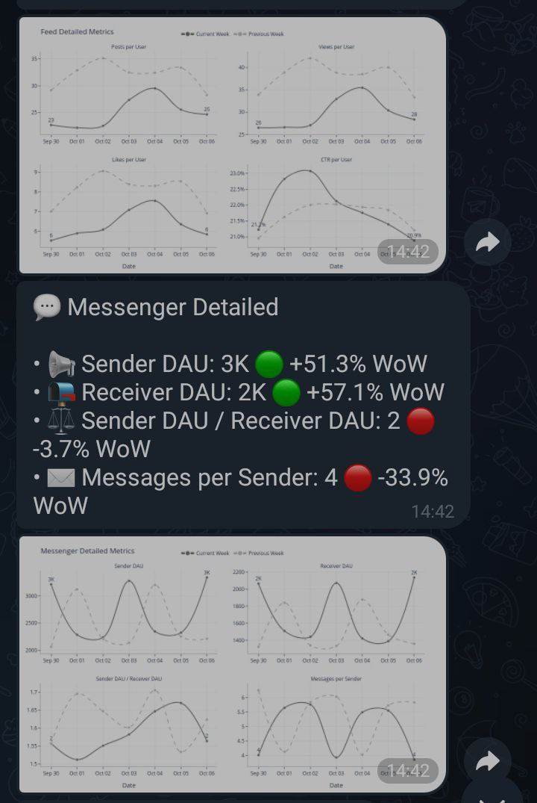

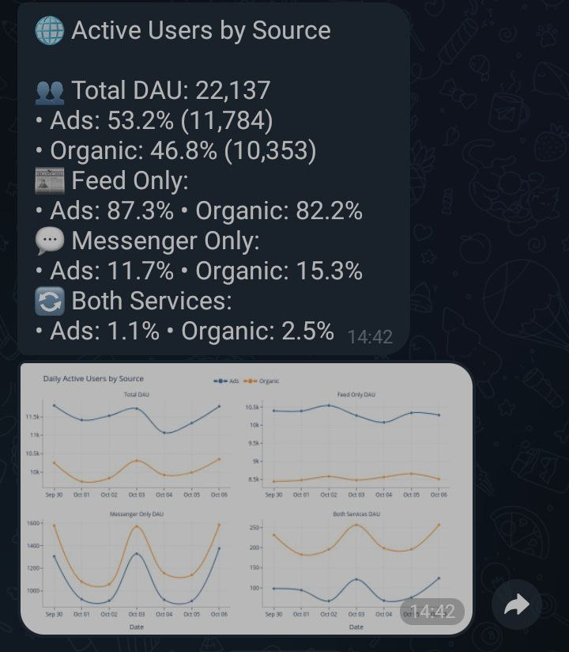

</details>

---

## 7. Anomaly Detection and Alerting

[View the anomaly-detection notebook](./building_startup_analytics/7_anomaly_detection/7_alert_system.ipynb)

### Problem

Daily dashboards may not be sufficient for operationally important product metrics.

A sudden decline in CTR, views, likes, active users, or messaging activity may require investigation before the next scheduled report.

### Implementation

I implemented a monitoring workflow that:

- Queries product metrics every 15 minutes
- Calculates historical reference intervals
- Uses the Median Absolute Deviation method
- Detects values outside configurable thresholds
- Creates an alert visualization
- Includes current and expected metric values
- Sends notifications through Telegram
- Runs continuously through Apache Airflow

### Metrics Monitored

#### Feed

- Active users
- Views
- Likes
- CTR

#### Messenger

- Active users
- Messages sent

### Detection Method

Median Absolute Deviation was used because it is more resistant to extreme historical values than methods that depend only on the mean and standard deviation.

The sensitivity can be adjusted by changing the threshold multiplier.

### Decision Value

The alerting layer demonstrates how product analytics can support operational monitoring, not only retrospective reporting.

<details>
<summary>View anomaly-alert screenshots</summary>

<br>

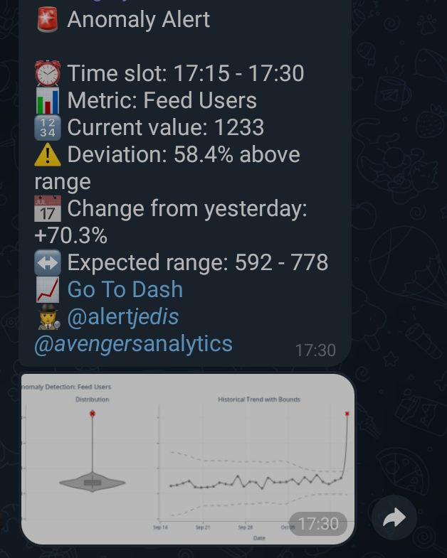

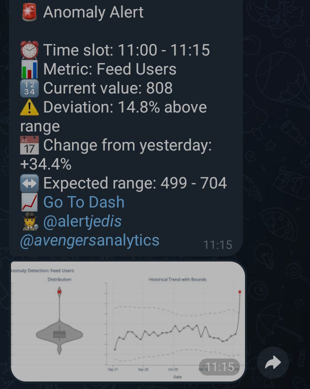

</details>

---

## Key Findings

The completed analysis produced several decision-relevant findings.

### Acquisition

- The advertising campaign generated a major increase in new users.
- Campaign users initially displayed engagement similar to organic users.
- Their Day-1 retention was substantially lower than comparable organic cohorts.
- Future campaign targeting should consider retained-user characteristics rather than only acquisition volume.

### Product Reliability

- A major feed-activity decline was geographically concentrated.
- Messaging remained comparatively stable in the affected locations.
- This helped isolate the issue to the feed experience or related infrastructure.

### Experimentation

- One recommendation experiment contained a suspicious bimodal distribution and should not be launched.
- The second recommendation approach produced a reliable CTR increase of approximately `0.0164`.
- A limited rollout with guardrail monitoring was recommended.

### Forecasting

- The DAU model achieved approximately `3.9%` SMAPE.
- The total-actions model achieved approximately `21.4%` SMAPE.
- Seven-day forecasts were more defensible than month-long forecasts given the available history.

### Monitoring

- Daily product reporting can be fully scheduled.
- Core product metrics can be checked every 15 minutes.
- Statistical alerts can identify unusual behavior and provide immediate investigation context.

---

## Skills Demonstrated

### SQL and Data Modeling

- Complex analytical SQL
- Window functions
- Conditional aggregation
- Cohort queries
- Retention calculations
- Funnel and engagement metrics
- Star schema design
- Fact and dimension tables
- Materialized views
- Incremental data loading
- Query optimization

### Python Analytics

- Data extraction
- Data cleaning
- Exploratory analysis
- Statistical testing
- Distribution analysis
- Forecasting
- Visualization
- Automated report generation
- API integration
- Reusable analytical functions

### Product Analytics

- KPI definition
- User engagement analysis
- Cohort analysis
- Retention analysis
- Churn analysis
- Segmentation
- Feature adoption
- Campaign evaluation
- Root-cause investigation
- User lifecycle decomposition

### Experimentation

- A/A testing
- A/B testing
- Sample-size estimation
- Statistical power
- Hypothesis testing
- Bootstrap analysis
- Experiment-quality validation
- Distribution diagnostics
- Practical significance
- Rollout recommendations

### Business Intelligence

- Dashboard planning
- Self-service reporting
- Metric documentation
- Stakeholder-focused design
- Filter and drill-down strategy
- Product-performance monitoring
- Executive communication

### Automation and Monitoring

- Airflow DAGs
- Scheduled ETL
- Daily reporting
- API-based message delivery
- Statistical anomaly detection
- Configurable alert thresholds
- Near-real-time monitoring
- Error handling

---

## Repository Structure

```text
building_startup_analytics/
│
├── 1_data_infrastructure/
│   ├── 1_analytical_database.ipynb
│   └── er.png
│
├── 2_product_dashboard/
│   ├── 2_product_dashboard.ipynb
│   ├── app_overview_tab_part_1.png
│   ├── app_overview_tab_part_2.png
│   ├── feed_deep_dive_tab_part_1.png
│   ├── feed_deep_dive_tab_part_2.png
│   ├── messenger_deep_dive_tab_part_1.png
│   ├── messenger_deep_dive_tab_part_2.png
│   └── documentation_part_*.png
│
├── 3_metric_deep_dive/
│   ├── 3_metric_deep_dive.ipynb
│   ├── marketing_company_part_*.png
│   ├── user_dropoff_part_*.png
│   └── user_decomposition_part_*.png
│
├── 4_ab_testing/
│   └── 4_ab_testing.ipynb
│
├── 5_metric_forecasting/
│   └── 5_metric_forecasting.ipynb
│
├── 6_automated_reporting/
│   ├── 6_automated_reporting.ipynb
│   └── app_report_telegram_part_*.jpg
│
└── 7_anomaly_detection/
    ├── 7_alert_system.ipynb
    └── anomaly_detection_part_*.jpg
```

---

## How to Review the Project

The notebooks are designed to be reviewed in sequence.

### Recommended Order

1. **Analytical Database**  
   Review the data model, metric queries, materialized views, and incremental ETL design.

2. **Product Dashboard**  
   Review the KPI framework, dashboard layout, filters, and documentation.

3. **Metric Deep Dive**  
   Review the retention analysis, campaign comparison, incident investigation, and lifecycle segmentation.

4. **A/B Testing**  
   Review experiment validation, statistical testing, distribution diagnostics, and rollout recommendations.

5. **Forecasting**  
   Review model selection, backtesting, error metrics, and capacity-planning recommendations.

6. **Automated Reporting**  
   Review scheduled KPI extraction, report generation, and Telegram delivery.

7. **Anomaly Detection**  
   Review the MAD-based detection logic, threshold configuration, Airflow schedule, and alert output.

---

## Reproducibility Notes

This repository contains the completed notebooks, analytical logic, visualizations, exported dashboard screenshots, reporting outputs, and alert examples.

Some components depend on external infrastructure or credentials that are not included in the repository:

- Source ClickHouse database access
- Yandex DataLens access
- Apache Superset deployment
- Apache Airflow environment
- Telegram bot token
- Telegram chat identifier
- Live production event data

Secrets should be stored in environment variables or a secure secret-management system and should never be committed to GitHub.

When adapting the project to another dataset, update:

- Database connection settings
- Source-table names
- Metric definitions
- Airflow schedules
- Telegram credentials
- Dashboard connections
- Historical windows
- Alert thresholds
- Forecasting parameters

---

## Potential Enhancements

### Data Engineering

- Add dbt models and automated data-quality tests.
- Introduce Bronze, Silver, and Gold data layers.
- Add freshness and row-count checks.
- Add schema-change detection.
- Create source-to-dashboard lineage documentation.
- Containerize ClickHouse, Airflow, and Superset with Docker Compose.
- Add CI checks for SQL and Python code.

### Product Analytics

- Add conversion funnels.
- Add session-level behavior analysis.
- Add feature-adoption cohorts.
- Add customer lifetime-value estimates.
- Add churn-risk segmentation.
- Add content-category analysis.
- Add acquisition-cost and return-on-ad-spend metrics.

### Experimentation

- Add confidence intervals for treatment effects.
- Add explicit guardrail metrics.
- Add sequential-testing controls.
- Add multiple-testing corrections.
- Add heterogeneous treatment-effect analysis.
- Add automated experiment scorecards.
- Add experiment metadata and decision logs.

### Forecasting

- Include external regressors.
- Add holiday and campaign effects.
- Compare with Prophet, ARIMA, and gradient-boosting approaches.
- Automate model retraining.
- Add forecast-drift monitoring.
- Add prediction-interval coverage checks.

### Monitoring

- Add separate warning and critical thresholds.
- Introduce seasonality-aware anomaly detection.
- Add alert deduplication.
- Add incident acknowledgement and resolution tracking.
- Add Slack or Microsoft Teams delivery.
- Add dashboards for alert frequency and false-positive rates.

### AI-Assisted Analytics

Potential AI extensions could include:

- Generating daily narrative summaries from validated KPI tables
- Explaining detected anomalies using retrieved historical context
- Providing natural-language access to documented product metrics
- Creating an experiment-summary assistant
- Producing stakeholder-specific report summaries
- Evaluating generated conclusions against approved analytical results
- Adding audit logs and human approval before sending AI-generated reports

These capabilities are not part of the current implementation and are listed as possible future work.

---

## What I Learned

Completing this project helped me understand how an analyst can support a product from initial data modeling through recurring operational decision-making.

Key areas of learning included:

- Translating event-level product data into clearly defined KPIs
- Designing a star schema for analytical workloads
- Building reusable SQL transformations
- Creating materialized views for dashboard performance
- Orchestrating incremental workflows with Airflow
- Designing dashboards around business questions rather than isolated charts
- Comparing acquired-user cohorts with organic users
- Investigating sudden metric changes through segmentation
- Distinguishing experiment-quality issues from actual treatment effects
- Applying multiple statistical methods to A/B test results
- Evaluating forecasts through backtesting instead of only in-sample fit
- Selecting forecast horizons based on available data
- Automating recurring stakeholder reports
- Building robust anomaly detection with configurable thresholds
- Connecting analytics with product, marketing, and engineering decisions
- Communicating limitations and recommendations alongside numerical results

---

## Project Status

This repository represents a completed learning and portfolio implementation.

The analysis is intended to demonstrate product analytics, experimentation, forecasting, automation, and monitoring techniques. Additional security, testing, infrastructure, and data-governance work would be required before adapting the system for sensitive production environments.

---

## Acknowledgements

PulseScope Analytics is based on the open-source [Building Startup Analytics](https://github.com/PavelGrigoryevDS/building-startup-analytics) project by Pavel Grigoryev.

The original project provided the underlying case study, data environment, implementation structure, notebooks, analyses, dashboards, and automation workflows used in this repository.

This repository retains the original MIT License and required copyright notices. Any modifications remain subject to the terms of that license.

---

